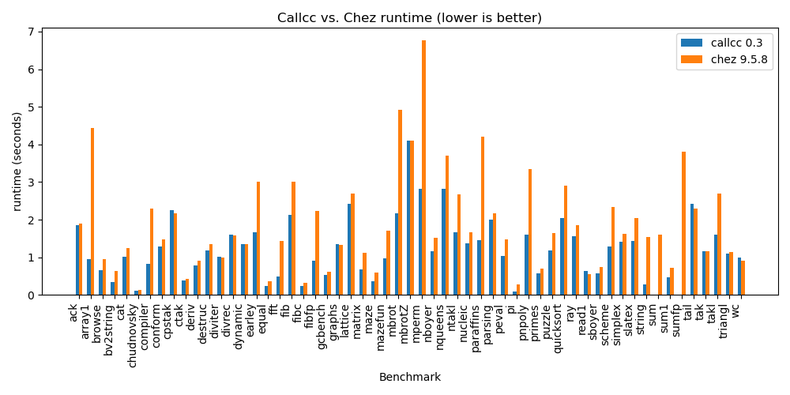

[](https://github.com/djwatson/callcc/actions/workflows/test.yml)

# CALLCC 

copyright Dave Watson 2025

A r7rs scheme compiler with an LLVM backend.

# Requirements

* libgmp
* libutf8proc
* modern clang, tested on version 19.
* A bootstrap scheme: Currently, guache is recommended
* Normal build machinery, like make, install, etc.

# Build

Assuming you have the build requirements, simply:

```
$ make 
```

Will produce a working executable.

# Install

```
$ PREFIX=/usr sudo make install
```

Prebuild DEB ubuntu packages are available in releases:

[Releases](https://github.com/djwatson/callcc/releases)

# Test

```
$ make test -j12 -k
```

# Cross-compilation

CALLCC supports cross-compilation to different architectures. Set the `ARCH` environment variable to specify the target architecture:

```bash
# Cross-compile for ARM64 Linux
$ ARCH=aarch64-linux-gnu make
```

The build system will automatically:
- Add `--target=$(ARCH)` to compiler flags
- Use appropriate libraries for the target platform
- Generate correct platform configuration

Supported cross-compilation targets include any architecture supported by your LLVM/Clang installation.

# Usage

Basic usage for the interpreter is to use -s or --script to run a scm file:

```
$ ./bin/callcc -s hello_world.scm
$ cat hello_world.scm
(display "Hello World!\n")
```

Usage for the compiler is via --exe, and optionally -o:

```
$ ./bin/callcc --exe hello_world.scm
$ ./hello_world
```

# Performance

Currently, the standard scm library is rebuilt for every exe.

For quicker builds, if you do not use eval, use -fno-eval.
This trims the executable size and build time substantially.

For maximum performance, the following C flags are recommended:
```
$ ./bin/callcc -fno-eval --cc "-O3 -flto" --exe whatever.scm
```

For even greater performance, PGO (profile guided optimization) can be
used.  For example:

```
$ ./bin/callcc -fno-eval --cc "-O3 -flto -fprofile-generate" --exe wc.scm
$ LLVM_PROFILE_FILE=a.profraw ./wc
$ llvm-profdata merge -output=a.profdata a.profraw
$ ./bin/callcc -fno-eval --cc "-O3 -flto -fprofile-use=a.profdata" --exe wc.scm
$ time ./wc
```

A benchmark run vs chez scheme on Ryzen 9 5900x (using PGO):



# Platforms

Tested and known to work:

* x86_64/linux
* aarch64/linux, aarch64/termux

There are ~50 lines of asm required for each platform, entirely for
fast call/cc support.  Everything else is relatively portable C/posix
or r7rs scheme.

The LLVM backend uses a few semi-portable flags, including 'musttail',
'preserve_none', 'preserve_all'.

Currently only x86_64 has been benchmarked for performance.


